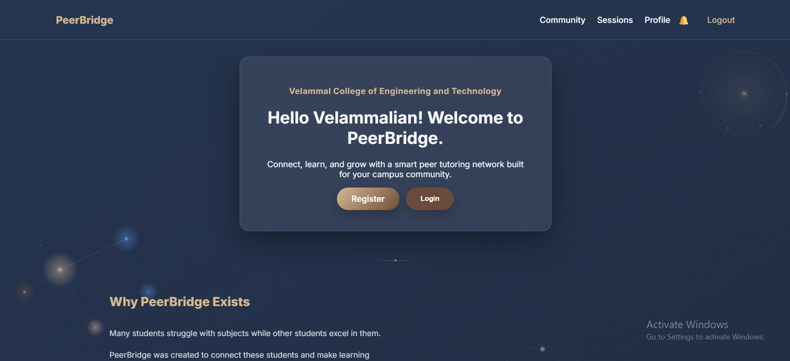
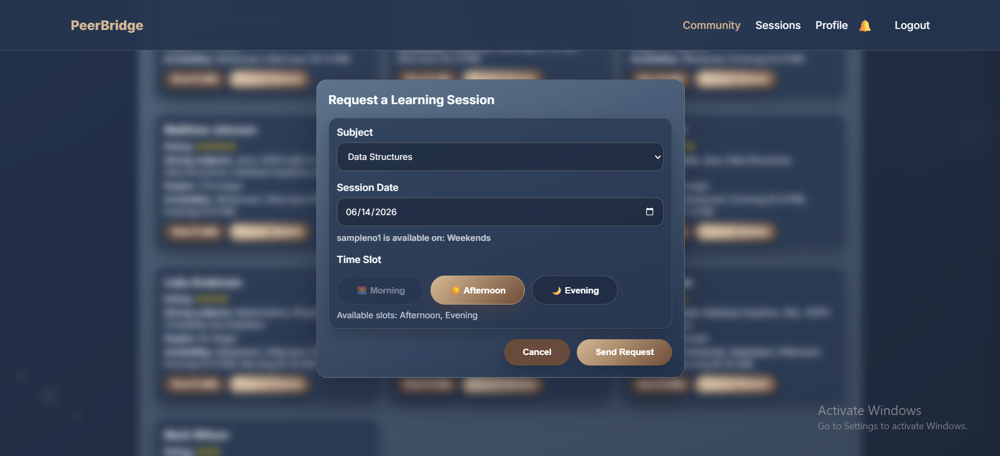
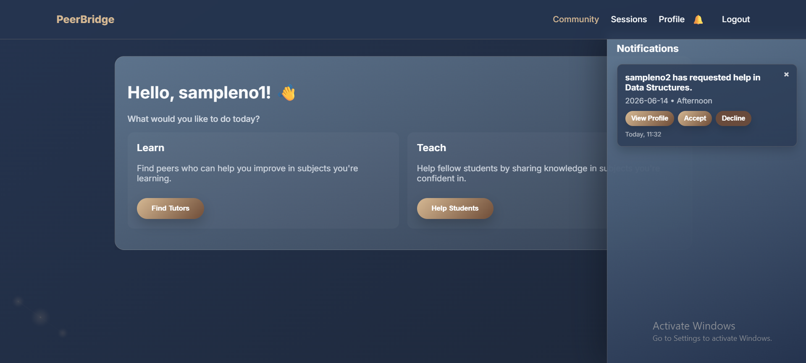
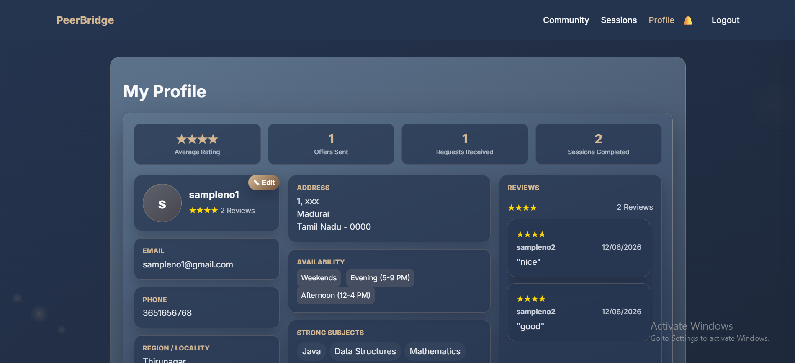

# PeerBridge

### Peer Tutoring Matchmaking Platform for Colleges

PeerBridge is a web-based platform that helps students connect with peers for academic support. Students can register their strong and weak subjects, discover suitable learning partners, schedule sessions, exchange feedback, and build credibility through ratings and reviews.

Originally developed as a hackathon solution, PeerBridge was later expanded and refined into a significantly improved web application prototype with enhanced user experience, mobile responsiveness, notifications, session management, and profile customization.

---

## Problem Statement

### PS 2.2 – Peer Tutoring Matchmaking System for Colleges

Students who struggle with specific subjects within their institution rarely have a structured mechanism to find peers who excel in those subjects and are willing to tutor.

The objective was to build a platform where students register with their strong and weak subjects, availability, and preferred session format while enabling meaningful connections between learners and tutors.

---

## Our Approach

Instead of treating students as fixed tutors or learners, PeerBridge allows every user to be both.

A student who is strong in one subject can help others while also seeking help in subjects they find challenging. This creates a collaborative learning environment where students teach, learn, and grow together.

---

## Features

### Account & Profile Management

- User registration and login
- Editable profiles
- Bio and academic information
- Strong and weak subject registration
- Custom subject creation
- Availability preferences
- Password reset functionality

### Discovery & Search

- Find tutors for weak subjects
- Find learners to help
- Search functionality
- Region-based filtering
- Rating-based discovery

### Session Management

- Send learning requests
- Offer help to peers
- Availability-aware scheduling
- Accept or decline requests
- Session completion tracking

### Notification System

- Real-time notifications
- Request updates
- Offer updates
- Session updates
- Notification management

### Feedback & Ratings

- Exchange ratings after sessions
- Written reviews
- Real-time profile updates
- Credibility building through peer feedback

### Profile Analytics

- Average rating tracking
- Review count
- Session statistics
- Request and offer tracking

### Responsive Design

- Desktop support
- Mobile-friendly interface
- Responsive navigation
- Mobile notification experience

---

## Application Workflow

1. Create an account
2. Register strong and weak subjects
3. Set availability preferences
4. Discover tutors or learners
5. Send a request or offer help
6. Accept or decline the request
7. Complete the learning session
8. Exchange ratings and feedback
9. Build credibility through reviews

---

## Technologies Used

### Frontend

- HTML
- CSS
- JavaScript

### Backend

- Firebase Firestore

### Development Tools

- Visual Studio Code
- Git
- GitHub
- GitHub Copilot
- ChatGPT

---

## My Learning Journey

PeerBridge began as a hackathon project built to solve the Peer Tutoring Matchmaking System for Colleges problem statement.

During the hackathon, my team and I successfully created a working prototype that demonstrated the core idea. While the functionality worked, the platform was still rough around the edges. Many interactions relied on simple alert boxes, the user interface was basic, and there was significant room for improvement.

After the hackathon ended, I decided to continue developing the project during my semester break rather than leaving it as a prototype.

Using HTML, CSS, JavaScript, Firebase, Git, GitHub, and AI coding assistants, I gradually improved the platform by redesigning workflows, refining the interface, improving mobile responsiveness, adding notifications, expanding profile functionality, improving session management, and introducing several quality-of-life features.

One thing that was important to me throughout this project was using AI as a development tool rather than a replacement for problem-solving. Instead of generating an entire application from a single prompt, I used AI to help implement ideas, debug issues, explore solutions, and accelerate development while keeping control over the design decisions, user experience, and overall direction of the project.

More than anything, this project helped me understand what goes into building software beyond writing code. It introduced me to version control, backend integration, responsive design, UI/UX thinking, testing, debugging, and the process of continuously improving a product through experimentation and iteration.

PeerBridge remains a prototype rather than a production-ready platform, but it represents an important milestone in my journey as a developer and has given me the confidence to continue building larger and more ambitious projects in the future.

---

## Screenshots

### Landing Page

### Session Request

### Notifications

### Profile Management

---

## Demo

**Live Website:** Add Link Here

**Project Demonstration Video:** Add Link Here

---

## Future Improvements

- Firebase Authentication
- Email verification
- Secure password recovery
- Calendar integration
- In-app messaging
- Study groups
- Community features
- Advanced recommendation systems

---

## Project Status

PeerBridge is currently a prototype built for learning, experimentation, and demonstration purposes.

While it successfully implements the core functionality required by the original problem statement, it is not intended for production deployment and still has several areas that could be expanded in the future.

---

## Acknowledgements

This project was initially developed during a hackathon as a solution to the Peer Tutoring Matchmaking System for Colleges problem statement.

Thank you to everyone who contributed feedback, ideas, and support throughout the development process.

---

## Developer Note

What started as a hackathon challenge eventually became much more than a competition submission.

PeerBridge gave me the opportunity to explore how ideas become software, how user experiences are designed, and how small details can significantly improve the overall quality of a product.

There are many features I would still like to add in the future, but this project represents an important step in my learning journey and serves as a reminder of how much can be accomplished through curiosity, persistence, and a willingness to learn.

Thank you for taking the time to explore this repository.
